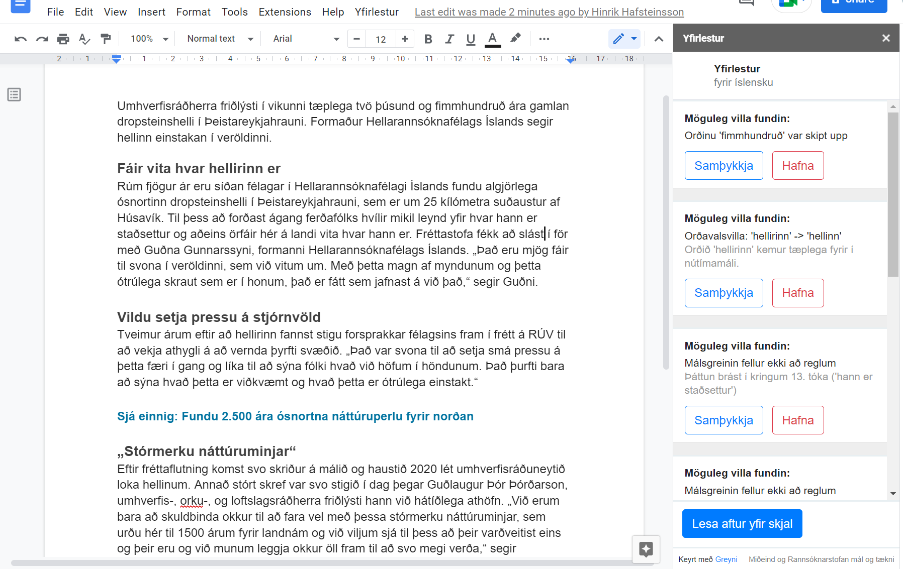

# Yfirlestur integration for Google Docs
--- 
This repo contains the source code for the *Yfirlestur Docs* spelling and grammar correction add-on for Icelandic, for use with Google Docs.

*Yfirlestur Docs* runs the [Yfirlestur.is](https://yfirlestur.is/) public API for spelling and grammar correction, which is owned and operated by [Miðeind ehf.](https://mideind.is/). 

The add-on is currently undergoing closed user-testing.

### Acknowledgements
---
- [University of Iceland Language and Technology Lab](http://linguist.is/language-and-technology-lab/)

This project was funded (partly) by the Language Technology Programme for Icelandic 2019-2023. The programme, which is managed and coordinated by [Almannarómur](https://almannaromur.is/), is funded by the Icelandic Ministry of Education, Science and Culture.

This Google Docs add-on uses the [React Google Apps Script](https://github.com/enuchi/React-Google-Apps-Script) boilerplate to integrate [ReactJS](https://reactjs.org/) into native Google Apps Script functionality.